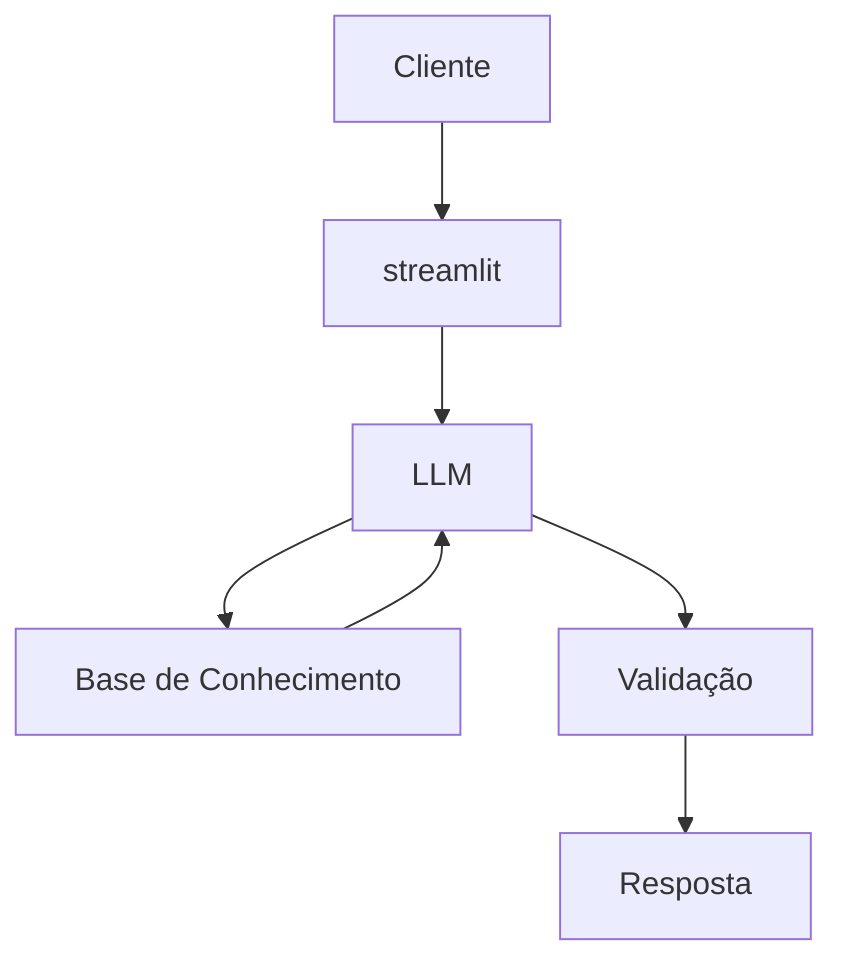

# Duca: Educador Financeiro IA

O Duca é um assistente de Inteligência Artificial desenvolvido para enesinar finanças pessoais. O agente utiliza dados históricos e perfis de usuários para criar exemplos práticos.

---

## Caso de Uso

### Problema
Muitos brasileiros tem problemas em compreender conceitos básicos sobre gestão financeira pessoal, tipos de investimentos e organização de seus gastos 

### Solução
O agente vai explicar os conceitos sobre gestão financeira de maneira simples

### Público-Alvo
Inicinates em financias pessoais que querem adentrar nesse mundo

---
## Persona e Tom de Voz

### Nome do Agente
Duca (Educador Financeiro)

### Personalidade
- Educativo
- Usa exemplos de simples compreensão
- Não ofende o usuário pelos seus gastos

### Tom de Comunicação
Informal e didático

### Exemplos de Linguagem
- Saudação: "Olá, eu sou o Duca, seu educador financeiro. No que posso te ajudar?"
- Confirmação: "Vou te explicar isso de maneira simples."
- Erro/Limitação: "Desculpa, não tenho essa informação."

---

## Arquitetura do  Sistema 

### Componentes

| Componente | Descrição |
|------------|-----------|
| Interface | [Streamlit](https://streamlit.io/) |
| LLM | [Ollama](https://ollama.com/) |
| Base de Conhecimento | JSON/CSV da pasta `data`|
| Validação | Checagem de alucinações |

---

## Como Executar

1. Certifique-se de ter o Ollama instalado
2. Instalar dependências:
```bash
pip install streamlit pandas requests
```
3. Rodar a aplicação:
```bash
streamlit run app.py
```
